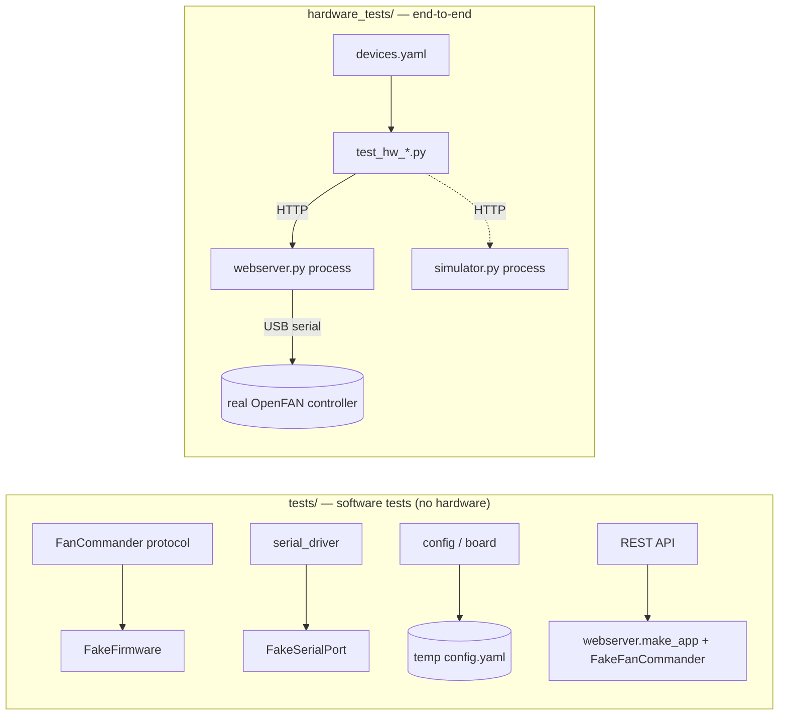

# Testing the OpenFAN software

This folder documents how the Python software in `Software/Python` is tested: what the tests
are, how they are put together, how to run them and how to extend them.

| Document | Read it when you want to... |
|---|---|
| [Running the tests](running-tests.md) | run tests locally (Windows/Linux/macOS), pick subsets, read results, understand the GitHub workflows |
| [Software tests](software-tests.md) | understand or extend `tests/`: unit and API tests that need no hardware |
| [Hardware tests](hardware-tests.md) | understand `hardware_tests/`: architecture, inventory, how a run works, fixtures, results |
| [Extending the hardware tests](extending-hardware-tests.md) | add a test, suite, feature, board or device, or change thresholds, timing and options |

## The two test layers



| | `tests/` (software tests) | `hardware_tests/` (hardware tests) |
|---|---|---|
| **Goal** | Every function and API route behaves as specified | The shipped server works with a specific physical controller |
| **Needs hardware** | No | Yes, or a simulated device (`sim-*`) |
| **Speed** | ~1 second | Seconds (simulated) to minutes (real fans) |
| **How the device is replaced** | In-process fakes (`tests/fakes.py`) | Not replaced: a real server process talks to a real controller, or to `simulator.py` |
| **Hardware-aware** | Board variants are simulated explicitly | Driven by the inventory `hardware_tests/devices.yaml` |
| **Runs in CI** | Every PR (`python_tests.yaml`) | Simulated devices on every PR; real devices on the lab runner (`hardware_tests.yaml`) |
| **Default for `run_tests`** | Yes | Only with `hardware` or a hardware option such as `--device` |

Both layers use **pytest**. `pytest.ini` in `Software/Python` is shared; its `testpaths = tests`
means a plain `pytest` / `run_tests` only runs the software tests.

## Quick start

From `Software/Python` (`run_tests.bat` on Windows, `./run_tests.sh` on Linux/macOS; the options are the same):

```bat
run_tests.bat --setup                  :: once: create .venv and install everything
run_tests.bat                          :: software tests
run_tests.bat --device sim-xl          :: hardware tests against a simulated OpenFAN XL
run_tests.bat --list-devices           :: inventory + plugged-in controllers
run_tests.bat --device lab-xl-01       :: hardware tests against a real controller
```

## Directory map

```
Software/Python/
├── pytest.ini                 shared pytest settings (testpaths, pythonpath, xfail_strict)
├── .coveragerc                coverage settings (--cov)
├── requirements-dev.txt       test dependencies (pytest, pytest-cov, requests, bs4, pytest-timeout)
├── run_tests.bat / .sh        one entry point for both layers
├── tests/                     software tests          → software-tests.md
│   ├── conftest.py            shared fixtures, state isolation
│   ├── fakes.py               FakeFirmware, FakeFanCommander, FakeSerialPort
│   └── test_*.py
├── hardware_tests/            hardware tests          → hardware-tests.md
│   ├── devices.yaml           inventory: boards, devices, wiring, suites
│   ├── conftest.py            pytest plugin: options, identity check, filtering, parametrization, results
│   ├── harness.py             server process, API client, polling, Expect
│   ├── inventory.py           inventory loader + CLI
│   ├── simulator.py           simulated controller behind the real server code
│   ├── summarize.py           results → Markdown report
│   └── test_hw_*.py           one file per suite
└── docs/testing/              this documentation
```
