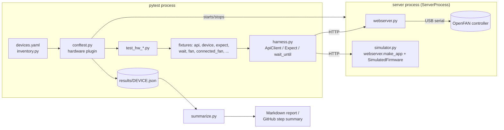
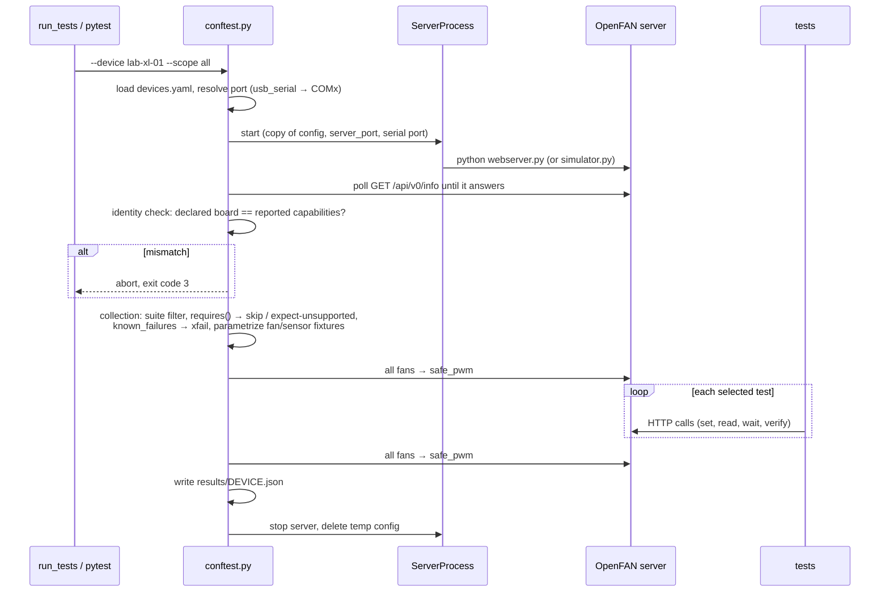

# Hardware tests (`hardware_tests/`)

End-to-end tests of the **real OpenFAN web server** talking to a **real controller**, or to a
simulated one. They check what a user would see: the service is up and talks to the right board,
the web page shows the right things in the right places, and changing a setting really changes
the fans (set a value → record the reading → change it → verify the reading changed).

The key idea: **tests know which hardware they run on.** Every controller is described in an
inventory (`devices.yaml`), and the test framework uses that description to decide which tests run
on a device, how they are parametrized, and what a correct answer is on that device, including
"this feature is correctly reported as unsupported".

## Architecture



| Component | Role |
|---|---|
| `devices.yaml` | Inventory: board **models** (what they can do) and **devices** (physical or simulated units, wiring, suites, known failures, timing) |
| `inventory.py` | Loads and validates the inventory (`Board`, `Device`, `AdHocDevice`), resolves serial ports, maps `/api/v0/info` capabilities to features. Also a CLI: `list`, `matrix` |
| `conftest.py` | The pytest plugin: command-line options, server start-up, **identity check**, suite and feature filtering, channel parametrization, fixtures, results file |
| `harness.py` | `ServerProcess` (runs the server with a temp config and captures its log), `ApiClient`, `wait_until`, `Expect`, `assert_error` |
| `simulator.py` | Runs the real `webserver.make_app()` with a `FakeFanCommander` whose firmware models fans (RPM follows PWM or RPM target; empty channels read 0) |
| `summarize.py` | Merges `results/*.json` into a Markdown report |
| `test_hw_*.py` | The tests, one file per suite |

The hardware tests are **black-box**: they only use HTTP. The server runs as a separate process,
exactly as users run it. The only thing that differs between a real and a simulated device is which
program `ServerProcess` starts.

## Lifecycle of a run



1. **Target selection** (`pytest_sessionstart`)
   * `--device NAME`: looked up in the inventory. For physical devices the port is `port`, or found
     by matching `usb_serial` against the connected serial ports. For `simulated: true` devices, `simulator.py` is used.
   * `--base-url URL`: nothing is started. With `--device`, that inventory profile is used and checked.
     Without it, an **ad-hoc profile** is built from `/api/v0/info` (with `--fans-connected` / `--sensors-connected` for wiring).
   * `--server-config FILE`: `webserver.py` is started with a copy of that config.
   * None of these: every hardware test is skipped with an explanation.
2. **Server start** (`ServerProcess.start`)
   * The config is **copied** to a temp folder, with `server.port` and `hardware.port` filled in.
     The server writes aliases and profiles back to its config, so your real `config.yaml` is never touched.
   * The server runs with `cwd = Software/Python`, `OPENFANCONFIG` pointing at the copy, and all
     output going to `results/<device>-server.log`.
   * The harness waits up to 45 s for `/api/v0/info`. If the process exits or never answers, the run
     aborts and shows the last lines of the log. An occupied `server_port` is detected up front.
3. **Identity check.** The declared board (`name`, `hw_rev`, `fan_count`, `sensor_count`, `features`)
   is compared with `/api/v0/info → capabilities`. Any difference aborts the run and lists each
   mismatch. This catches a swapped USB cable, a different board model, or firmware that changed capabilities.
4. **Collection** (`pytest_generate_tests`, `pytest_collection_modifyitems`)
   * channel fixtures are parametrized from the profile;
   * tests outside the selected suites are **deselected**;
   * `requires(feature)` handling depends on `--scope` (see below);
   * `known_failures` entries become strict `xfail`s;
   * with pytest-timeout installed, each test gets a timeout of `timing.test_timeout_s`.
5. **Safe state.** Before and after the run, every fan is set to the device's `safe_pwm`.
6. **Results.** `results/<device>.json` is written, then the server is stopped and the temp folder deleted.

With `--collect-only` / `--list` and an inventory device, steps 2–3 are skipped: listing tests never touches the hardware.

## The inventory (`devices.yaml`)

```yaml
defaults:                 # applied to every device, each key can be overridden per device
  safe_pwm: 0
  timing: {settle_s: 5, poll_s: 0.5, test_timeout_s: 180}
  rpm: {min_running_rpm: 300, min_increase_pct: 20, target_tolerance_pct: 10}

boards:                   # board MODELS: must match what the server reports
  openfan-xl:
    name: OpenFAN XL
    hw_rev: "4"
    fan_count: 10
    sensor_count: 4
    features: [pwm, temperature, aliases]

devices:                  # physical / simulated UNITS
  lab-xl-01:
    enabled: true
    board: openfan-xl
    usb_serial: "E6614C311B2F4B28"
    server_port: 3102
    fans_connected: [0]
    sensors_connected: [0]
    suites: [smoke, html, fan_control, aliases, sensors]
    known_failures:
      "test_hw_fan_control.py::test_rpm_follows_pwm[fan3]": "fan 3 tach wire damaged (issue #61)"
```

### `boards.<key>`

| Key | Meaning |
|---|---|
| `name` | Board name exactly as `/api/v0/info` reports it (`capabilities.name`) |
| `hw_rev` | Hardware revision string (`capabilities.hw_rev`) |
| `fan_count`, `sensor_count` | Channels the board has |
| `features` | Subset of `pwm`, `rpm_control`, `profiles`, `temperature`, `aliases` |

### `devices.<name>`

| Key | Default | Meaning |
|---|---|---|
| `board` | required | Key under `boards:` |
| `enabled` | `true` | Only enabled physical devices are picked up by the GitHub hardware workflow |
| `simulated` | `false` | Run `simulator.py` instead of `webserver.py`, no hardware needed |
| `port` | — | Serial port (`COM7`, `/dev/ttyACM0`, `/dev/serial/by-id/...`) |
| `usb_serial` | — | USB serial number; the port is looked up from it (survives port renumbering) |
| `server_port` | required unless `--server-port` | TCP port for this device's server (unique per device, so devices can run in parallel) |
| `config` | — | Base `config.yaml` for the server (copied, never modified) |
| `fans_connected` | `[]` | Fan channels with a real fan; RPM **measurements** only run on these |
| `sensors_connected` | `[]` | Sensor channels with a real sensor |
| `suites` | all suites | Suites that run on this device by default |
| `known_failures` | `{}` | `{"<nodeid suffix>": "reason"}` → strict xfail on this device only |
| `safe_pwm`, `timing`, `rpm` | from `defaults` | Per-device overrides (merged key by key) |

The inventory is validated when loaded: unknown boards, features or suites, and channels outside the board's range, abort the run with a clear message.

Feature ↔ capability mapping (`inventory.features_from_capabilities`):

| Feature | Reported capability | API when unsupported |
|---|---|---|
| `pwm` | `fw_support_pwm` | — |
| `rpm_control` | `fw_support_rpm` | error "`does not yet support RPM control`" |
| `profiles` | `has_profiles` | error "`does not support fan profiles`" |
| `temperature` | `has_sensors` | error "`does not support temperature sensors`" |
| `aliases` | always | — |

## Suites, features and scope

**Suites** group tests by area. Each `test_hw_*.py` sets one suite marker for the whole file:

| Suite | File | Covers |
|---|---|---|
| `smoke` | `test_hw_service.py` | `/api/v0/info` matches the inventory, version string, fan status shape, 404, index validation |
| `html` | `test_hw_html.py` | page title, one tile per fan and sensor, fan selector, profile selector, slider range, footer build |
| `fan_control` | `test_hw_fan_control.py` | PWM on every channel, RPM follows PWM, set-all, empty channels read 0, RPM targets |
| `profiles` | `test_hw_profiles.py` | list, add/remove, applying profiles changes fan speed, unknown profile |
| `aliases` | `test_hw_aliases.py` | set/get/restore on every channel, invalid characters, invalid index |
| `sensors` | `test_hw_sensors.py` | read all/each sensor, plausible values on connected sensors, invalid index |

A device runs its `suites` unless `--suite` overrides them. Other tests are **deselected**.

**Features** are what a test needs from the hardware or firmware: `@pytest.mark.requires("rpm_control")`.
What happens when the device lacks the feature depends on `--scope`:

| | Device has the feature | Device lacks it, `--scope supported` (default) | Device lacks it, `--scope all` |
|---|---|---|---|
| Test | runs normally | **skipped**: "`rpm_control` not supported by lab-xl-01" | runs with `expect.unsupported == True` and must verify the documented error |
| If the API accepts the call anyway | — | — | **fails**: the inventory and the API disagree |

A test that `requires` a feature is written once and handles both cases:

```python
@pytest.mark.requires("rpm_control")
def test_rpm_target_is_reached(api, connected_fan, device, wait, expect):
    reply = api.raw(f"/api/v0/fan/{connected_fan}/rpm?value=1200")
    if expect.unsupported:                 # only in --scope all, on devices without rpm_control
        expect.unsupported_error(reply)    # status=error + documented message, or the test fails
        return
    assert reply["status"] == "ok"
    ...
```

Use `--scope supported` for day-to-day runs and `--scope all` for full verification (the nightly run uses it).

## Channel parametrization

These fixtures are generated from the device profile. Each value becomes its own test with an id
like `[fan3]`, so results and `known_failures` can target individual channels.

| Fixture | Values | Typical use |
|---|---|---|
| `fan` | every fan channel of the board (`0..fan_count-1`) | commands must be accepted on every channel |
| `connected_fan` | `fans_connected` | RPM measurements (needs a real fan) |
| `disconnected_fan` | board channels **not** in `fans_connected` | empty channel must read 0 RPM |
| `invalid_fan_index` | `fan_count..9` | API must reject indices beyond the board |
| `sensor` | `0..sensor_count-1`, or `[0]` as a probe on boards without sensors | single-sensor reads |
| `connected_sensor` | `sensors_connected` | plausibility checks on real sensors |
| `invalid_sensor_index` | `sensor_count..9` (only if the board has sensors) | API must reject indices beyond the board |

An empty list becomes a single skipped test with a reason ("no fans connected on lab-xl-01",
"OpenFAN XL uses every channel index 0..9"), so gaps in coverage stay visible.

## Fixtures and helpers reference

| Fixture | Scope | Provides |
|---|---|---|
| `hw` | session | run state: `hw.device`, `hw.info` (the `/api/v0/info` data), `hw.base_url`, `hw.scope`, `hw.suites` |
| `device` | session | the `Device`: `.name`, `.board` (`.name`, `.fan_count`, `.sensor_count`, `.features`), `.fans_connected`, `.sensors_connected`, `.has(feature)`, `.rpm`, `.timing`, `.safe_pwm` |
| `api` | session | `ApiClient` for the server under test |
| `timing` | session | `{"settle_s", "poll_s"}` from the device |
| `wait` | test | `wait(condition, message, timeout=None)`: polls `condition()` with the device's timing until it returns something truthy; returns that value or fails with `message` |
| `expect` | test | `Expect`: `.unsupported`, `.unsupported_error(reply)` |
| `safe_fan_state` | session, autouse | all fans → `safe_pwm` before and after the run |

`ApiClient` (`harness.py`):

| Method | Returns / checks |
|---|---|
| `http(path, method="GET", data=None)` | raw `requests.Response`, no checks |
| `raw(path, method, data)` | JSON envelope `{status, message, data}`; asserts HTTP 200 + valid envelope |
| `get(path)` / `post(path, fields)` | `data` of a successful call; asserts `status == "ok"` |
| `html(path="/")` | `BeautifulSoup` of the page; asserts HTTP 200 |
| `fan_rpm(fan)`, `all_fan_rpm()` | current RPM readings |
| `log` | list of every call `(method, path, status_code, body)`, handy when debugging |

Also in `harness.py`: `assert_error(reply, contains="")` and `wait_until(condition, timeout, interval, message)`.

## The simulator

`simulator.py` serves the **real** web server code (`webserver.make_app`) with a `FakeFanCommander`
(from `tests/fakes.py`) whose `SimulatedFirmware` models:

* connected fans spin at `pwm / 255 × 2000` RPM (±2 % noise), or follow an RPM target;
* empty channels read 0 RPM;
* connected sensors read 21.5 °C, 23.0 °C, ... (`21.5 + 1.5 × index`); others read 0;
* fans boot at 100 % PWM.

Simulated devices (`sim-controller`, `sim-xl`, `sim-micro`) run in seconds and are what CI uses on
every PR. They verify the tests themselves, the web server, the HTML templates and the API. They
cannot find hardware or firmware problems: that's what the physical devices are for.

You can also start it by hand and point the tests (or a browser) at it:

```bash
python hardware_tests/simulator.py --config /tmp/sim.yaml --board "OpenFAN XL" \
       --fans-connected 0,3 --sensors-connected 0,2
```

It listens on `server.port` from the config (3000 if the file is new), on 127.0.0.1 only.

## Results

`results/<device>.json`:

```json
{
  "device": "lab-xl-01", "board": "OpenFAN XL", "simulated": false,
  "scope": "all", "suites": ["smoke", "html", "fan_control", "aliases", "sensors"],
  "features": ["aliases", "pwm", "temperature"], "fans_connected": [0], "sensors_connected": [0],
  "info": { "...": "/api/v0/info data" },
  "counts": {"passed": 57, "unsupported-verified": 16, "skipped": 2},
  "results": [
    {"nodeid": "...::test_rpm_target_is_reached[fan0]", "outcome": "unsupported-verified",
     "suites": "fan_control", "features": "rpm_control", "expect_unsupported": "rpm_control",
     "duration_s": 0.01, "message": ""}
  ]
}
```

| Outcome | Meaning |
|---|---|
| `passed` | passed |
| `unsupported-verified` | passed in expect-unsupported mode: the API correctly refused an unsupported feature |
| `skipped` | skipped (reason in `message`) |
| `xfailed` | expected failure from `known_failures` (reason in `message`) |
| `failed` / `error` | failed; `message` holds the assertion |

`summarize.py` turns one or more result folders into a Markdown report: a per-device table
(passed / unsupported ✔ / skipped / known / failed), a feature × device matrix, and a list of
failures. The GitHub workflows append it to the run's summary page.

## Troubleshooting

| Symptom | Cause / fix |
|---|---|
| `no hardware target selected` (all skipped) | add `--device`, `--base-url` or `--server-config` |
| `no serial port with USB serial ... found` | controller unplugged, wrong `usb_serial`, or no permission to open it (Linux: `dialout` group) |
| `TCP port 31xx is already in use` | another server is running (maybe a previous run or your own). Stop it, change `server_port`, or test it with `--base-url` |
| `server ... exited during start-up` | read the log excerpt shown; the full log is in `results/<device>-server.log` |
| `does not match the inventory` | the controller on that port isn't the declared board, or the firmware changed capabilities. Fix the cable or the inventory |
| `inventory says X does not support Y, but the API accepted the call` | the inventory's `features` are out of date, or the API forgot to gate the feature |
| RPM tests time out | fan not connected on that channel, or it needs longer to settle: raise `timing.settle_s` for that device |
| `XPASS(strict)` | a `known_failures` entry or `xfail` no longer fails: remove it |
