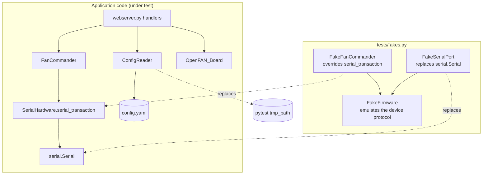

# Software tests (`tests/`)

Fast unit and API tests for the code in `Software/Python`. They need **no hardware**, never touch
the real `config.yaml`, and run in about a second.

## Architecture

The application talks to the controller through one narrow seam: `SerialHardware.serial_transaction(payload)`
sends a request line such as `>02037F` and returns the reply lines. The tests replace the
layers below the part being tested:



| Test file | Code under test | How the hardware is replaced |
|---|---|---|
| `test_fancommander.py` | `FanCommander.py`: command encoding, reply parsing, USB discovery | `FakeFanCommander` → `FakeFirmware` |
| `test_serial_driver.py` | `serial_driver.py`: open/close, send, read, timeouts, plus one full-stack test | `serial.Serial` monkeypatched to `FakeSerialPort` → `FakeFirmware` |
| `test_board.py` | `board.py`: board type and capabilities from the HW info string | HW info strings produced by `FakeFirmware` |
| `test_config.py` | `config.py`: load, defaults, save, profiles, aliases, instance isolation | real files in `tmp_path` |
| `test_api.py` | `webserver.py`: every REST route, validation, capability gating, service start-up | real Tornado server on a random port, backed by `FakeFanCommander` |

### `fakes.py`

**`FakeFirmware`** emulates the firmware's host protocol (`Firmware/src/Application/host_communication.c`).
Requests are `>CC` followed by hex data bytes; replies are `<CC|payload` + CRLF.

| Cmd | Meaning | Request | Reply payload |
|---|---|---|---|
| `00` | all fan RPM | `>00` | `00:04B0;01:04E2;...;` (index:RPM, hex) |
| `01` | one fan RPM | `>01` + fan | `03:04B0` |
| `02` | set fan PWM | `>02` + fan + pwm (0–255) | `03:7F` |
| `03` | set all PWM | `>03` + pwm | `FF` |
| `04` | set fan RPM | `>04` + fan + rpm_hi + rpm_lo | `00:04B0` |
| `05` | HW info | `>05` | CRLF, then one `KEY:VALUE` line per property (`MCU:PICO2040`, ...) |
| `06` | FW info | `>06` | `FW_REV:01`, `PROTOCOL_VERSION:01` lines |
| `0B` | one temperature | `>0B` + sensor | `02:00FA` (signed 0.1 °C) |
| `0C` | all temperatures | `>0C` | `00:00FA;01:FF9C;...;` |

State you can set or inspect in a test:

| Attribute | Meaning |
|---|---|
| `rpm` | `{fan: rpm}` the device reports (default `1000 + 100 × index`) |
| `pwm`, `target_rpm` | last PWM (0–255) / RPM target received per fan |
| `temperatures` | `{sensor: tenths of °C}` (default `{0: 250, 1: -100, 2: 0, 3: 1234}`) |
| `hw_info`, `fw_info` | lines returned for `05` / `06`. Use `HW_INFO_CONTROLLER`, `HW_INFO_XL`, `HW_INFO_MICRO` |
| `log_noise=True` | prefix every reply with a debug log line (tests that noise is skipped) |
| `requests` | every request received |

**`FakeFanCommander(firmware)`** is a real `FanCommander` subclass. It skips the serial-port
constructor and overrides only `serial_transaction()`, so every encoding and parsing method of the
real class is exercised. `commander.sent` lists every payload sent.

**`FakeSerialPort`** is a drop-in for `serial.Serial` that routes writes to `FakeSerialPort.firmware`
(a class attribute; `None` means the device never answers). `inject(text)` queues unsolicited
bytes. **`make_port_info(...)`** builds a `ListPortInfo` for USB discovery tests.

### `conftest.py` fixtures

| Fixture | Scope | Provides |
|---|---|---|
| `isolate_shared_state` | autouse | resets `FanCommander` class-level dicts and `FakeSerialPort` class attributes before each test |
| `reset_fake_serial_port` | autouse | resets `FakeSerialPort.firmware` / `.instances` |
| `firmware` | test | a fresh `FakeFirmware()` (Controller board) |
| `commander` | test | `FakeFanCommander(firmware)` |
| `config_path` | test | path of a not-yet-existing `config.yaml` in `tmp_path` |
| `config` | test | `ConfigReader(config_path)` |

`test_api.py` adds its own:

| Fixture | Provides |
|---|---|
| `make_api(hw_info)` | factory: starts the API for a board in a background thread, returns an `ApiClient` |
| `api` | API for the OpenFAN Controller |
| `xl_api` | API for the OpenFAN XL |
| `service_env` | patches `webserver.FanCommander` and `OPENFANCONFIG` to test `FAN_API_Service` start-up |

`ApiClient` (in `test_api.py`) offers `fetch(path, method, fields)` → `(code, headers, body)`,
`get_json(path)`, `post_json(path, fields)`, plus `.commander`, `.firmware` and `.config` for
checking side effects. The git version functions are patched, so `/api/v0/info` is deterministic.

### Configuration (`pytest.ini`)

| Setting | Why |
|---|---|
| `testpaths = tests` | a bare `pytest` runs only the software tests |
| `pythonpath = . tests` | the app uses flat imports (`from config import ...`); tests import `fakes` |
| `addopts = -ra` | the summary shows why things were skipped or xfailed |
| `xfail_strict = true` | a known-bug test that starts passing fails the run (see below) |

`.coveragerc` excludes `tests/*` from coverage and shows missing lines.

## Known bugs: the `xfail` convention

A test that documents a bug still in the code is marked:

```python
@pytest.mark.xfail(strict=True, reason="Known bug: <what is wrong>")
def test_<expected_correct_behaviour>(...):
    ...   # assert the CORRECT behaviour
```

* While the bug exists, the test shows as `x` / `XFAIL` and the run stays green.
* When someone fixes the bug, the test passes. With `strict=True` it is then reported as
  **`XPASS(strict)` = failure**, which is the prompt to delete the marker. From then on, the test
  guards against the bug coming back.
* `run_tests known-bugs` runs just these tests; `pytest --runxfail` shows their real failures.

Currently marked:

| Test | Bug |
|---|---|
| `test_config.py::test_get_all_fan_profiles_does_not_modify_stored_profiles` | `get_all_fan_profiles()` writes a `name` key into stored profiles |
| `test_fancommander.py::test_malformed_rpm_reply_does_not_crash` | `_parse_fan_rpm()` raises `IndexError` on a reply without `|` |
| `test_fancommander.py::test_no_reply_does_not_crash` | no reply → `_sendCommand()` returns `False` → `AttributeError` |
| `test_serial_driver.py::test_wait_for_re_string_with_regex` | inverted `if not status_re` check → `UnboundLocalError` |

## Adding tests

### Where does it go?

| You changed... | Add tests to |
|---|---|
| a command or reply format in `FanCommander.py` | `test_fancommander.py` (and teach `FakeFirmware` the command) |
| `serial_driver.py` | `test_serial_driver.py` |
| board detection or a new board in `board.py` | `test_board.py` (+ an `HW_INFO_*` constant in `fakes.py`) |
| `config.py` | `test_config.py` |
| a REST route or handler in `webserver.py` | `test_api.py` |

Name tests after the behaviour, e.g. `test_set_rpm_clamps` rather than `test_rpm_2`. Use
`pytest.mark.parametrize` for tables of inputs and expected outputs.

### Example: a new protocol command

Suppose the firmware gains `0x0D`: set fan curve.

1. **Teach the fake** in `FakeFirmware.respond()`:

   ```python
   elif cmd == 0x0D:   # set fan curve
       self.curves[data[0]] = data[1:]
       body = f"{data[0]:02X}"
   ```

   and initialise `self.curves = {}` in `__init__`.

2. **Test the encoding** by adding a row to `test_command_encoding`:

   ```python
   ("set_fan_curve", (2, [10, 50, 90]), ">0D020A325A"),
   ```

3. **Test the effect/parsing**:

   ```python
   def test_set_fan_curve_reaches_firmware(commander, firmware):
       commander.set_fan_curve(2, [10, 50, 90])
       assert firmware.curves[2] == [10, 50, 90]
   ```

### Example: a new REST route

```python
def test_fan_curve_route(api):
    reply = api.get_json("/api/v0/fan/2/curve?points=10;50;90")
    assert reply["status"] == "ok"
    assert api.commander.sent == [">0D020A325A"]


def test_fan_curve_rejects_bad_points(api):
    reply = api.get_json("/api/v0/fan/2/curve?points=abc")
    assert reply["status"] == "error"
    assert api.commander.sent == []          # nothing reached the device
```

For another board, use `make_api(HW_INFO_XL)` / `make_api(HW_INFO_MICRO)` or the `xl_api` fixture.

### Example: a new board model

1. Add `HW_INFO_NEWBOARD = ["HW_REV:05", "MCU:NEWMCU", ...]` to `fakes.py`.
2. Add a row to the `parametrize` table in `test_board.py::test_board_capabilities` with the expected capabilities.
3. Add API tests for anything board-specific (channel limits, unsupported features) using `make_api(HW_INFO_NEWBOARD)`.
4. For the hardware suite, see [Extending the hardware tests](extending-hardware-tests.md#add-a-board-model).

### Example: documenting a bug you are not fixing now

```python
@pytest.mark.xfail(strict=True, reason="Known bug: alias longer than 64 chars is accepted")
def test_alias_length_is_limited(api):
    reply = api.get_json("/api/v0/alias/0/set?value=" + "a" * 65)
    assert reply["status"] == "error"
```

## Pitfalls

* **Never write to the real `config.yaml`.** Always go through `config_path` / `tmp_path`.
  `ConfigReader` joins its argument with the module folder, and an absolute path wins.
* **Class-level state.** Anything stored on a class (not an instance) leaks between tests. Reset it in
  `isolate_shared_state`, or better, move it to `__init__`.
* **Don't use `tornado.testing.AsyncHTTPTestCase`.** Some Tornado/pytest version combinations can't
  collect it. `test_api.py` runs the server in a thread instead, which works everywhere and supports `parametrize`.
* **Git-dependent output.** `version.py` shells out to `git`; `test_api.py` patches it. Do the same in new
  tests that check version strings.
* **Line endings.** Repository files use CRLF, except `*.sh`, which must stay LF.
